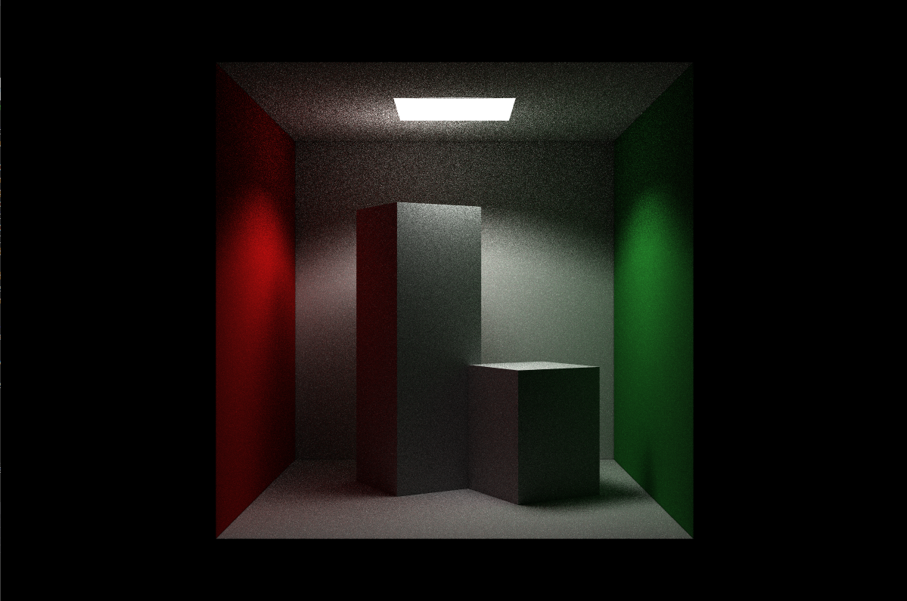

# CAP 6721 Raytraacing Spring 2021 OptiX 7/7.3 project for simple Rayaabb cornell box

## File Description:
This code has been originally started from the template provided at [https://github.com/ingowald/optix7course](https://github.com/ingowald/optix7course) , project explores optix 7.3 (latest version) for simple Cornell box rendering

Code is divided in two folders common & optix7cornellbox, common folder has some utility functions related to windowing provided by optix7 course & is unchanged, my changes lie in optix7cornellbox, code division is simple & minimal here

* LaunchParams.h  -> contains definitions on launch parameters to be passed to optix program, this is equivalent to sending parameters to optix raytracing program

* SampleRenderer.h , SampleRenderer.cpp-> contains a struct object that abstracts setting up optix & communicating with it, it can launch optix program with specified launch parameters, set up the scene in Optix, Download results back from Optix to host

* CUDABufer.h ->interface implementation for the complexity of managing CUDA Device pointers by useful wrapper functions which allocate, copy & free the memory on device

* optix7.h -> loads necessary optix header files, implements useful CUDA sync, cuda check functions required for cuda programs

* devicePrograms.cu -> cuda code file which contains shaders for raytracing, gets compiled into .ptx binary string & is launched by Optix program

* main.cpp -> Entry point function, instantiates AABB objects, with necessary transformations & material properties, also creates a sample renderer & GLFW window object, combines these two to successfully display rendering in a window with track controls

* sample folder contains the samples of rendering with different SPP configuration

# Build Instructions 
  Project Built on Windows with RTX 3070 graphics card, CUDA 11 & Visual Studio 2019 Community Edition
  CMake files are kept as its from the original git repo with minimal changes to folder structure
  So build instructions from Author's repo should hold for non tested platforms such as Linux

## Building under Windows
  * For windows, CUDA capable device is required with Optix 7 installed
  * CUDA must be in the system environment path
  * Launch CMake GUI, pass project path & pass desired project path where you want VS solution, configure &  generate
  * Run the VS solution file in VS, set optix7cornellbox project as startup project & run
  * Works best with turing architecture as they have separate RT cores for handling BVH & shader pipelines

## Dependencies

- A compiler
    - On Windows, tested with Visual Studio 2019 community editions
- Minimum CUDA 10.1
    - Download from developer.nvidia.com
- Latest NVIDIA developer driver that comes with the SDK
    - download from [http://developer.nvidia.com/optix](http://developer.nvidia.com/optix) and click "Get OptiX"
- OptiX 7 SDK
    - download from [http://developer.nvidia.com/optix](http://developer.nvidia.com/optix) and click "Get OptiX"
    

The only *external* library used is GLFW for windowing, and
even this one is built on the fly under Windows

# Camera Controls
  - " , " to reduce spp
  - " . " to add spp
  - " d " to toggle single channel denoiser On/Off

# Acknowledgement 
  - This code has been developed from templates of [https://github.com/ingowald/optix7course](https://github.com/ingowald/optix7course) & the slides of 2019 Siggraph course on "RTX Accelerated Ray Tracing with OptiX"  [https://drive.google.com/open?id=1_IYHwAZ4EoMcDmS0TknP-TZd7Cwmab_I](https://drive.google.com/open?id=1_IYHwAZ4EoMcDmS0TknP-TZd7Cwmab_I)
  - Original Author Ingo Wald from NVIDIA [https://github.com/ingowald](https://github.com/ingowald)
  - Also checkout [https://github.com/owl-project/owl](https://github.com/owl-project/owl) OWL wrappper library for Optix 7 which might ease your work

# Samples
  - 
  - 
